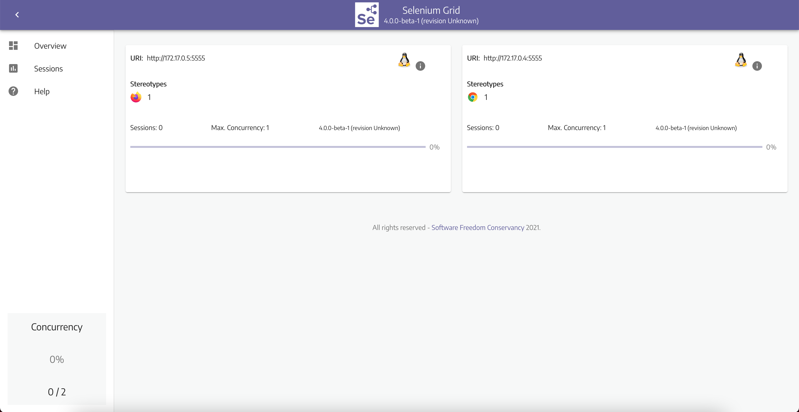
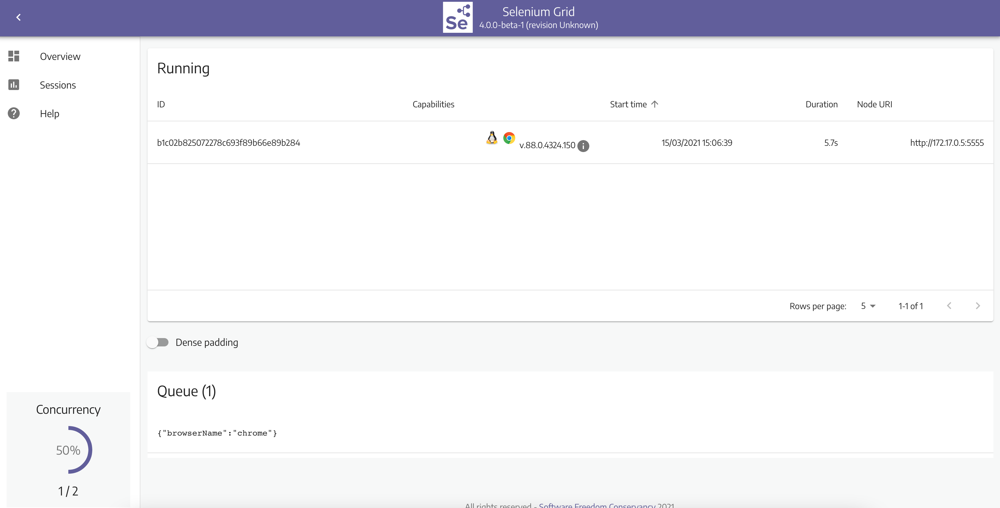

# IBM Test Platform Cloud - Plateforme de test

## Introduction

IBM Test Platform Cloud est un asset IBM Interactive fournissant une plateforme de test portable pour orchestrer et éxecuter des tests avec Selenium dans Kubernetes.

IBM Test Platform Cloud est composé de ces éléments :

-   **[Selenium Grid](https://www.selenium.dev/documentation/en/grid/)** permet d'exécuter des tests sur plusieurs navigateurs conteneurisés à partir d'un point central, avec une vaste combinaison de navigateur.
-   **[Tekton](https://tekton.dev/)** est un _framework_ open source pour créer des systèmes CI/CD. Il nous permet ici d'orchestrer et déclencher les tests

---

# Pour commencer

> **NOTE:**  
> Ce tutoriel concerne l'installation et le paramétrage de Selenium et Tekton. Ce tutorial ne concerne pas l'installation d'un ingress controller et/ou d'un manager de certificat pour exposer ces services avec un nom de domaine personnalisé.  
> Si vous souhaitez exposer en public les composants ci-dessus, merci de vous référez à la documentation de l'ingress controller que vous choisirez (e.g. Ingress Controller : [NGINX Ingress Controller](https://kubernetes.github.io/ingress-nginx/)) (e.g. Manager de certificat : [cert-manger](https://cert-manager.io/docs/)).

## Pré-requis:

-   Un cluster Kubernetes version ≥ 1.18 avec minimum 2 CPUs et 8 RAM \*
-   [kubectl](https://kubernetes.io/docs/tasks/tools/) doit être installé, vérifiez avec `kubectl version`
-   [Node.js](https://nodejs.org/en/) doit être installé, vérifiez avec `node -v`
-   Un clone de ce répertoire

\* À des fins de tests, vous pouvez utiliser [minikube](https://github.com/kubernetes/minikube) en local :

```
minikube start --cpus 2 --memory 6144
```

## Étape 1 - Installation de Selenium

### Installation :

Tout d'abord, utilisez kubectl pour créer le namespace selenium :

```
kubectl create namespace selenium
```

Placez-vous à la racine du répertoire cloné et créez les `deployment` et les `service` du hub selenium, du node chrome et du node firefox en appliquant le YAML :

```
kubectl apply -f ./kubernetes-yaml/selenium
```

Donnez au cluster quelques minutes pour tirer l'image de Selenium Hub et faire fonctionner le pod Selenium Hub.  
Utilisez `kubectl` pour vérifier l'état du pod :

```
kubectl get po -n selenium
```

Vous obtiendrez un résultat comme celui-ci :

```
NAME                                    READY   STATUS    RESTARTS   AGE
selenium-hub-8b9876dd8-rh7mc            1/1     Running   0          11m
selenium-node-chrome-5c86d6cc75-kqhnc   1/1     Running   0          56s
selenium-node-firefox-767b6dd98-b9bl8   1/1     Running   0          51s
```

### Connexion au dashboard :

Vous pouvez à présent vous connecter au dashboard de Selenium Hub.  
Pour se faire nous allons utiliser `port-forward`

> Note :  
> Ici, nous utilisons `port-forward` pour accéder au dashboard, mais vous pouvez très bien utilisez `proxy`.
> Vous également exposer le service du dashboard en public en utilisant une règle `ingress`.

Ouvrez un **nouveau terminal** et executez :

```
kubectl port-forward service/selenium-hub 4444 -n selenium
```

Maintenant ouvrez un navigateur et rentrez l'adresse [http://localhost:4444](http://localhost:4444).



## Étape 2 - Exécutez vos premiers tests en local

Clonez le repertoire [**poc-k8s-selenium/tests-javascript**](https://eu-de.git.cloud.ibm.com/poc-k8s-selenium/tests-javascript), répertoire qui contient des exemples de script en JavaScript avec [jest](https://jestjs.io/)

Tout d'abord, placeez-vous dans celui-ci et installez les dépendences avec npm :

```
cd ./tests-javascript
npm install
```

Ensuite vous pouvez démarrer les tests avec

```
BROWSER=chrome SELENIUM_HUB=http://localhost:4444/wd/hub npm run test tests/google
```

-   `BROWSER` est la variable qui définit le navigateur dans lequel vont être exécutés les tests. Dans l'exemple ci-dessus on utilise `chrome`, mais vous pouvez également utilisez `firefox`.
-   `SELENIUM_HUB` est la variable qui correspond à l'url de l'hôte de Selenium Hub.
-   `tests/google` correspond à la suite de test qui va être utilisée. Ce champ est optionnel.
-   **ATTENTION :** vous devez avoir un terminal ouvert avec le `port-forward` en cours vers Selenium Hub.

Vous pouvez surveiller la file de session dans le dashboard Selenium [http://localhost:4444/ui/index.html#/sessions](http://localhost:4444/ui/index.html#/sessions)



On voit sur cette impression d'écran qu'il y a une session dans la file en attente, et une session en cours d'execution.

Résultat :

```
Test Suites: 2 passed, 2 total
Tests:       4 passed, 4 total
Snapshots:   0 total
Time:        91.119 s, estimated 96 s
```

Vous remarquerez la création d'un dossier `allure-results` dans le répertoire de test, ce dossier contient l'ensemble le résultat des tests généré par Allure au format json.

## Étape 3 - Installation de Tekton

## Auteurs

-   **[Victor Moin](https://w3.ibm.com/bluepages/profile.html?uid=Y9DJPP706)**
