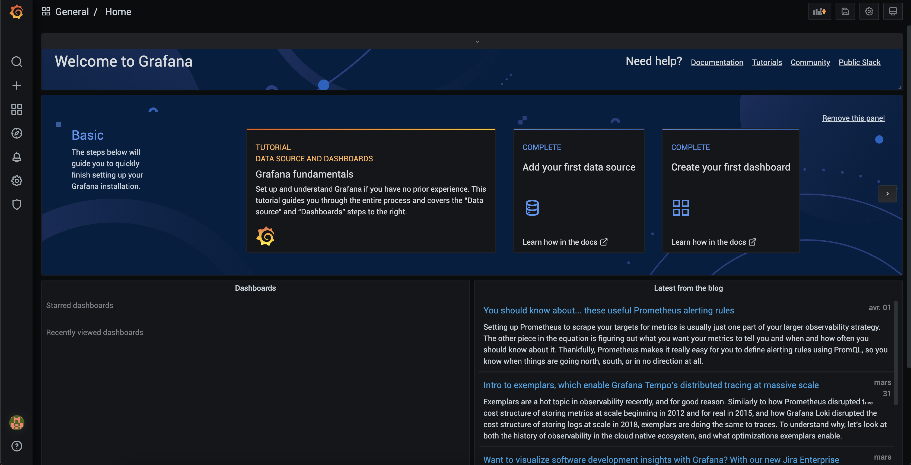
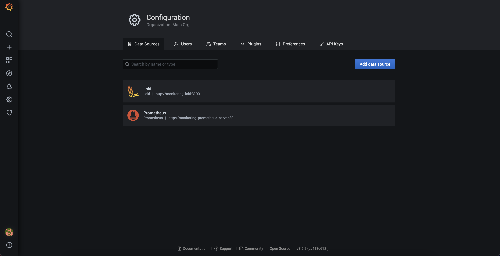

## Étape X - Installation du système de Monitoring

Pour le monitoring, nous utilisons ici la suite Loki. Cette suite est composé de :

-   [Fluent-Bit](https://fluentbit.io/) : transporteur de logs
-   [Loki](https://grafana.com/oss/loki/) et [Prometheus](https://prometheus.io/) : Loki est une base de données pour les logs applicatifs alors que Prometheus est une base de données pour les logs d'infrascture
-   [Grafana](https://grafana.com/) : application web permettant d'inspecter et de créer des dashboard des logs

> Note :  
> La suite de ce tutorial se concentre sur l'installation du système de login entièrement dans notre cluster Kubernetes, c'est-à-dire, le collecteur, la base de donnée et l'interface web dans ce même cluster.

## Pré-requis:

-   Assurez-vous d'avoir installé **[Helm](https://helm.sh/)**

### Installation :

D'abord ajoutez le chart Loki à votre repertoire Helm :

```
helm repo add grafana https://grafana.github.io/helm-charts
```

```
helm repo update
```

Ensuite, placez-vous à la racine de `kubernetes-yaml/loki-stack`
Et inspecter le fichier values.yml

> Note :  
> Si vous utilisez **IKS** _(IBM Cloud Kubernetes Service)_, vous devez rajouter les valeurs ci-dessous dans le `values.yml`, sinon laissez tel quel.

```
# UNIQUEMENT SI IKS (IBM Cloud)
fluent-bit:
  enabled: true
  volumes:
    - name: varlog
      hostPath:
        path: /var/log
    - name: varlibdockercontainers
      hostPath:
        path: /var/log/pods
        type: Directory
  volumeMounts:
    - name: varlog
      mountPath: /var/log
    - name: varlibdockercontainers
      mountPath: /var/log/pods
      readOnly: true
```

Ensuite, vous pouvez installer le chart en éxecutant les commandes :

```
create namespace monitoring
```

```
helm upgrade --install monitoring grafana/loki-stack -n monitoring -f ./values.yml
```

Vous obtiendrez un résultat similaire à :

```
NAME: monitoring
LAST DEPLOYED: Thu Apr  1 19:45:22 2021
NAMESPACE: default
STATUS: deployed
REVISION: 1
NOTES:
The Loki stack has been deployed to your cluster. Loki can now be added as a datasource in Grafana.
```

### Connexion à Grafana :

Vous pouvez à présent vous connecter à Selenium Hub.

Commencez par récupérer le mot de passe d'administration en exécutant la commande :

```
kubectl get secret monitoring-grafana -n monitoring -o jsonpath="{.data.admin-password}" | base64 --decode ; echo
```

Ensuite nous allons utiliser `port-forward` pour accéder au dashboard.
Ouvrez un **nouveau terminal** et executez :

```
kubectl port-forward service/grafana 8080:80 -n monitoring
```

Maintenant ouvrez un navigateur, dirigez vous sur l'adresse [http://localhost:8080](http://localhost:8080) et connectez-vous avec l'identifiant `admin` et le mot de passe ci-dessus



Enfin, naviguez dans l'onglet configuration et vérifiez que Loki et Prometheus ont bien été configurés



Si vous les voyez apparaître comme dans l'image ci-dessus, c'est que tout est bon ! :clap: :clap: :clap:
